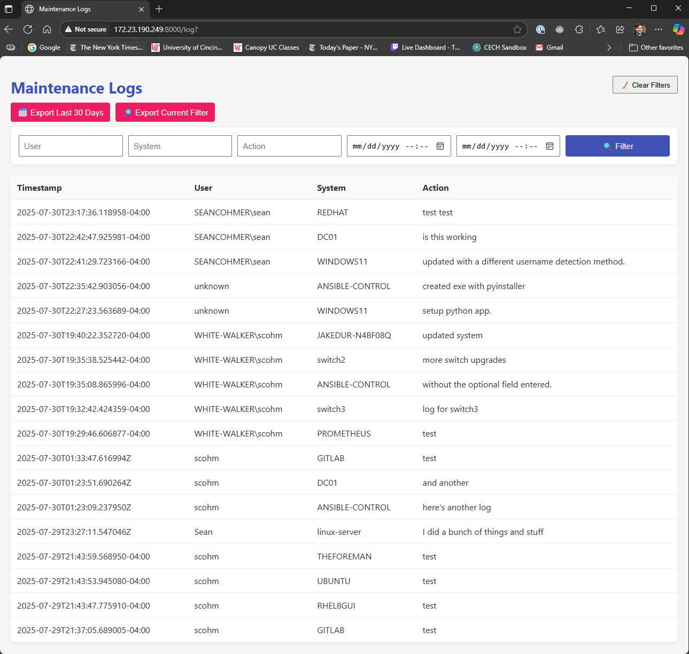
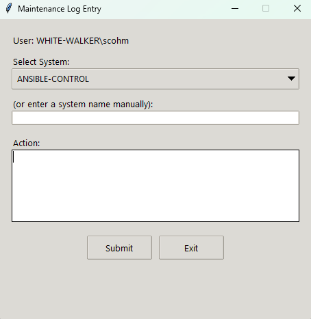

# Maintenance Logger

Create a .env file with the following variables  

```
# API server (your FastAPI backend)  
API_SERVER_IP = "server.domain.com"                  # Replace with your server IP or hostname  
API_SERVER_PORT = 8000  

# LDAP connection details  
LDAP_SERVER = "ldap://dc01.seancohmer.com"           # Replace with your AD server  
LDAP_USER = "SEANCOHMER\\ldap_read"                  # Replace with AD bind account  
LDAP_PASSWORD = 'Pa$$w0rd'                           # Replace with password  
LDAP_BASE_DN = "DC=seancohmer,DC=com"                # Replace with your domain base DN  
```
# Server Interface
Here is a screenshot of the server interface:  



# Client Interface
Here is a screenshot of the client interface:

